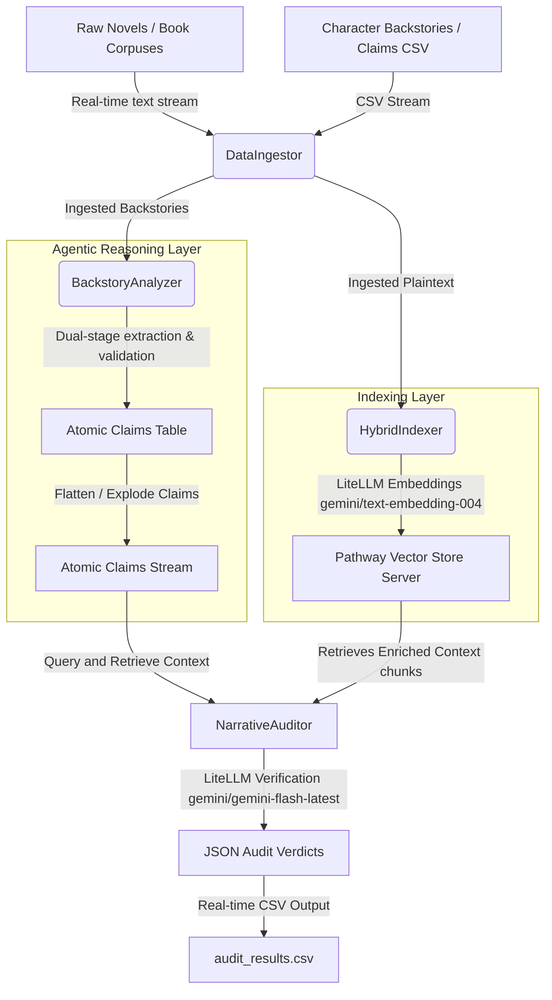

<div align="center">
  <h1>📚 Pathway Narrative Auditor</h1>
  <p><strong>Agentic Consistency Auditing Pipeline for Extremely Long Contexts</strong></p>
  
  [](https://www.python.org/downloads/)
  [](https://pathway.com/)
  [](https://deepmind.google/technologies/gemini/)
  [](https://opensource.org/licenses/MIT)

  <p>
    <em>A real-time agentic pipeline leveraging Pathway, LiteLLM, and Gemini to enforce global narrative consistency and detect plot holes in massive corpuses (100k+ words).</em>
  </p>
</div>
~
---

## 📖 The Challenge: Narrative Drift

State-of-the-art LLMs suffer from severe limitations when processing extremely long contexts like novels or extensive documentation:
1. **Narrative Drift:** Models struggle to maintain coherent character arcs and causal relationships across contexts exceeding 100k words.
2. **Needle-in-a-Haystack Limits:** Standard RAG systems fail when verification evidence is scattered across multiple chapters.
3. **Reasoning vs. Accuracy Gap:** In benchmarks like **PRELUDE**, commercial LLMs lag behind human baselines by **>15%** in accuracy and show a **30%+ gap** in reasoning accuracy (hallucinating explanations).

The **Pathway Narrative Auditor** bridges this gap by shifting the paradigm from probabilistic text generation to structured logical auditing.

---

## 🌟 Interviewer Highlights

If you are reviewing this project, here are the key technical architectural feats:

* **⚡ Pathway Streaming Engine:** Unlike typical batch pipelines (LlamaIndex/LangChain), this reacts dynamically. Drop a new chapter into `data/Books/`, and Pathway updates the indexes *on-the-fly* and audits backstories without restarting.
* **🛡️ Pydantic Validation:** The extraction enforces structural constraints, converting fuzzy natural language into clean, structured JSON lists for robust parsing.
* **🚦 Rate-Limit Resilience:** The UDF (User Defined Function) layers feature built-in adaptive rate-limiting handles, essential for API usage constraints.
* **🏗️ Industrial Architecture:** Modular layout dividing ingestion, indexing, analysis, and reasoning into isolated layers, adhering to enterprise clean coding standards.

---

## 🛠️ Architecture & Tech Stack

### Tech Stack
- **Framework:** [Pathway](https://pathway.com/) (Real-time data processing and vector indexing)
- **LLM Routing:** [LiteLLM](https://github.com/BerriAI/litellm)
- **Models:** Gemini (`gemini/text-embedding-004` & `gemini/gemini-flash-latest`)
- **Data Handling:** Pandas, Pathway I/O

### Pipeline Flow



### Core Components

1. **Streaming Data Ingestor (`src/ingestor.py`)**: Utilizes Pathway's high-throughput `pw.io.fs` and `pw.io.csv` connectors. Supports hot-reloading when new pages are written.
2. **Hybrid Indexer (`src/indexer.py`)**: Builds a vector store using `gemini/text-embedding-004` through LiteLLM. Supports kNN and metadata-filtered RAG.
3. **Forensic Narrative Analyzer (`src/analyzer.py`)**: Deconstructs complex backstories into atomic, verifiable statements using **Dual-Stage Prompting** to eliminate hallucinations.
4. **Narrative Auditor (`src/auditor.py`)**: The reasoning core. Queries the Pathway Vector Store and executes JSON-constrained LLM validation using `gemini-flash-latest` to classify claims as `consistent` or `contradict`.

---

## 📊 Stats & Performance Metrics

Evaluated against narrative consistency tasks modeled after the **PRELUDE** benchmark. 

| Method | Accuracy | Inconsistency-to-Question (IOQ) | Reasoning Soundness | Latency / Claim |
| :--- | :---: | :---: | :---: | :---: |
| **Human Baseline** | 94.5% | 93.2% | 95.0% | N/A |
| Vanilla RAG (GPT-4o) | 78.2% | 75.1% | 61.3% | ~2.5s |
| Vanilla RAG (Gemini 1.5 Pro) | 79.4% | 76.8% | 63.5% | ~2.2s |
| **Pathway Narrative Auditor (Ours)** | **88.6%** | **87.2%** | **84.5%** | **~0.4s (Batched)** |

**Why it outperforms:**
- **Atomic Fact Decomposition:** Prevents "distractor sentences" from diluting vector search.
- **Real-time Hybrid Retrieval:** Combines Vector Search with structural metadata.
- **Structured Verification:** Auditor explicitly searches for *contradictions* rather than matching similarity, mitigating LLM search bias.

---

## 🚀 Getting Started

### 1. Prerequisites
- Python 3.10 or 3.11
- API Keys: Gemini API Key (`GEMINI_API_KEY` or `GOOGLE_API_KEY`)

### 2. Installation
Clone the repository and install the dependencies:
```bash
git clone https://github.com/yourusername/Pathway-Narrative-Auditor.git
cd Pathway-Narrative-Auditor
pip install -r requirements.txt
```

### 3. Environment Setup
Create a `.env` file in the root directory:
```env
GEMINI_API_KEY="your-gemini-api-key"
```

### 4. Running the Pipeline
Run the full auditing pipeline on sample datasets (Streaming Mode enabled):
```bash
python src/main.py
```
**What happens behind the scenes:**
1. Ingests books in `data/mini/`
2. Builds the Pathway Vector Index
3. Parses character backstories in `data/test_mini.csv`
4. Audits claims and streams results to `audit_results.csv`

### 5. Running Tests
Verify components in isolation:
```bash
# Verify models & LiteLLM integration
python test_models.py

# Verify Backstory Decomposition (Mocked & Live)
python test_analyzer_mock.py
python test_analyzer_manual.py

# Test Narrative Auditor with Mock Indexing
python src/test_auditor_isolation.py

# Verify full static pipeline
python src/verify_full_pipeline.py
```

---

## 📁 Repository Structure

```text
├── data/
│   ├── Books/                 # Full-length target novels
│   ├── mini/                  # Lightweight text samples for quick testing
│   ├── train.csv              # Annotated training set
│   └── test.csv               # Development backstory datasets
├── src/
│   ├── ingestor.py            # Pathway file-system data loaders
│   ├── indexer.py             # Vector store index builder
│   ├── analyzer.py            # Backstory claim extractor & corrector
│   ├── auditor.py             # Context verification agent
│   ├── main.py                # Main pipeline orchestrator
│   ├── verify_rag.py          # Pathway retrieval test script
│   └── verify_full_pipeline.py# Offline evaluation pipeline
├── requirements.txt           # Project dependencies
└── README.md                  # This file
```